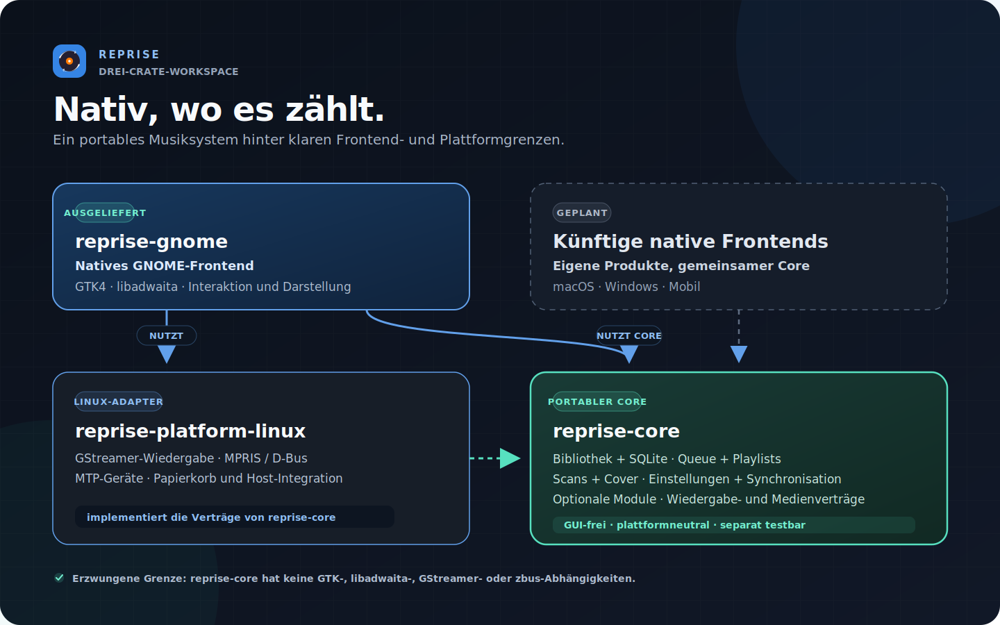

<div align="center">

<picture>
  <source media="(prefers-color-scheme: light)" srcset="assets/wordmark-light.svg">
  
</picture>

<p><strong>Ein nativer GTK4-/libadwaita-Musikplayer für GNOME in Rust — und ein Testfeld für einen portablen Core mit schlanken nativen Frontends.</strong></p>

<p><a href="README.md">English</a> · <a href="README.de.md">Deutsch</a></p>

<p>
  
  
  
  
  
  
  
</p>

<p><sub>Gestartet am 11. Juli 2026 · aktives Portfolio-Projekt · noch kein öffentliches Release · Evidenz aktualisiert am 21. Juli 2026</sub></p>

</div>

Reprise denkt zuerst an lokale Musiksammlungen: virtualisierte Ansichten für
große Bibliotheken, ernsthafte Metadatenwerkzeuge, Hörstatistiken, Android-Sync
und eine enge GNOME-Integration. Gleichzeitig ist das Produkt ein
Architekturexperiment: Das Domänenverhalten lebt in einem plattformneutralen
Rust-Core; jede Plattform soll nur eine kleine, wirklich native UI- und
Integrationsschicht ergänzen.

## Oberfläche

<table>
  <tr>
    <td width="50%">
      
      <p align="center"><sub>Track-Bibliothek — persistente sortierbare Spalten, Metadatenpanel, Bibliothekszustand</sub></p>
    </td>
    <td width="50%">
      
      <p align="center"><sub>Albumraster — Detailpanel und aus dem Cover abgeleiteter Player-Akzent</sub></p>
    </td>
  </tr>
  <tr>
    <td width="50%">
      
      <p align="center"><sub>Artist-Seiten — Alben, Top-Tracks und Hörverlauf</sub></p>
    </td>
    <td width="50%">
      
      <p align="center"><sub>My Stats — Hörstunden, Top-Artists und -Alben, Aktivitätsdiagramm</sub></p>
    </td>
  </tr>
</table>

<p align="center"><sub>Designsystem-Previews, keine erfundenen Laufzeit-Screenshots. Aufnahmen der laufenden App ersetzen sie nach der nativen GNOME-Sichtprüfung.</sub></p>

## Heutiger Produktumfang

| Bereich | Gebaut |
|---|---|
| Bibliothek | SQLite-Katalog, virtualisierte Track-/Album-/Artist-Ansichten, inkrementelle Scans, Live-Watcher sowie Move- und Missing-Erkennung |
| Wiedergabe | GStreamer mit Gapless, Crossfade, Zehnband-Equalizer, ReplayGain, Queue, Shuffle/Repeat und Waveform-Seeking |
| Metadaten | Multi-Track-Tag-Editor, der nur geänderte Felder schreibt, MusicBrainz-Lookup, eingebettete/lokale/Online-Cover |
| Suche und Organisation | Vollfeldsuche, Filter-Chips, persistente Spalten, manuelle/smarte Playlists, M3U-Import und -Export |
| Lyrics und Discovery | Synchronisierte/statische Lyrics, gecachter LRCLIB-Lookup, optionale Artist- und Album-News |
| Desktop | MPRIS-Medientasten, Quick Settings, Benachrichtigungen, Sperrbildschirm-Metadaten, Themes und Cover-Akzent |
| Geräte | Android-MTP-Browsing und Delta-Sync mit Fortschritt, Abbruch, Playlists und optionalem Opus-Transcoding |
| Dienste | Unabhängige, standardmäßig deaktivierte ListenBrainz-/Last.fm-Module mit Keyring-Credentials und Offline-Queues |
| Migration und Sicherheit | Einmaliger Rhythmbox-Import, Session-Restore ohne Autoplay, Missing-/Import-Flows, nur Datenbank-Remove, bestätigter Papierkorb |

## Architektur: ein Core, native Ränder



| Crate | Verantwortung | Erzwungene Grenze |
|---|---|---|
| `reprise-core` | Bibliothek, Datenbank-Facades, Queue-Semantik, Playlists, Settings, Module und Plattformverträge | Keine GTK-, libadwaita-, GStreamer-, zbus- oder GLib-Abhängigkeit |
| `reprise-gnome` | GTK4-/libadwaita-Komposition, native Interaktionen, Accessibility, Theme und Präsentation | Kein produktives SQL, blockierendes HTTP, direkte GStreamer-Kopplung oder ungeprüftes Unsafe |
| `reprise-platform-linux` | Linux-Implementierungen für Audio, Medienintegration, Geräte, Waveforms und Papierkorb | Implementiert die Core-Verträge; UI-Code erhält Interfaces |

Das ist bewusst keine gemeinsame Web-Shell. Der Rust-Core besitzt Daten und
Verhalten; plattformspezifische Frontends besitzen native Interaktionsmuster.
Die GTK-App beweist die Grenze heute. Weitere Frontends sind eine Roadmap-
Richtung und keine bereits ausgelieferte Behauptung.

## Performance: messen, ändern, vergleichen

Performance-Arbeit beginnt mit generierter Evidenz, nicht mit Bauchgefühl.
Release-Benchmarks erzeugen isolierte Metadatenprofile mit 10.000 und 100.000
Tracks, behalten stabiles JSON samt Commit-/Build-Manifest, verweigern
bestehende Ausgabeordner und berühren weder Musikdateien noch eine reale
Benutzerdatenbank.

Die erste benchmarkgetriebene Optimierung ersetzte Full Scan plus temporäre
Sortierung durch einen partiellen `NOCASE`-Titelindex. Der akzeptierte
Same-Host-Vergleich mit 100.000 Tracks maß:


| Messung | Vorher | Nachher | Ergebnis |
|---|---:|---:|---:|
| Letztes Titel-Fenster mit 200 Zeilen | 53.605 µs | 1.333 µs | **-97,51 %** |
| Projektion der Playback-IDs | 8.125 µs | 298 µs | **-96,33 %** |
| SQLite-Plan | Full Scan + temporärer B-Tree | partieller Index-Scan | temporäre Sortierung entfernt |
| Datenbankgröße | Ausgangswert | +2.379.776 Bytes | **+9,85 %** expliziter Trade-off |

Das Tracklistenmodell bleibt unabhängig davon auf **8 gecachte SQL-Fenster und
1.600 gehaltene Zeilen** begrenzt — gleich bei 10.000 und 100.000 Tracks. Fünf
frische Prozesse maßen 100.000 Queue-Einträge mit einem RSS-Delta von 1.609.728
Bytes beziehungsweise **16,10 Byte/Track**.

```sh
scripts/performance-baseline.sh /tmp/reprise-before
# Kandidatenänderung implementieren und danach deren Commit messen
scripts/performance-baseline.sh /tmp/reprise-after
scripts/performance-query-compare.sh \
  /tmp/reprise-before /tmp/reprise-after > /tmp/query-comparison.json
```

Die vollständige Runtime-Suite beobachtet zusätzlich Startzeit der installierten
App, realisierte GTK-Zeilen/-Zellen, Provider-/Modellzahlen, Queue-Speicher und
eine CUA-gesteuerte Scroll-Reaktion. Sind private D-Bus-/Xvfb-/AT-SPI-Sockets
nicht verfügbar, bricht sie geschlossen ab und fällt nie auf den echten Desktop
zurück. Laufzeiten sind Vergleichsevidenz auf demselben Host, keine portablen
CI-Grenzwerte; deterministische Cache- und Speicherbudgets sind harte Tests.

## Kennzahlen

| Metrik | Aktuelle Evidenz |
|---|---:|
| Rust-Code | 125.878 Zeilen |
| — Produktcode | 80.385 Zeilen |
| — Testcode | 45.493 Zeilen |
| Workspace-Gate | 1.903 bestandene Tests: 996 Core · 830 GNOME · 77 Linux-Plattform |
| Tests mit kontrollierten Bedingungen | 229 vom Standardlauf getrennt: 228 GNOME-Display-/Host-Tests · 1 Linux-Benchmark |
| UX-Verträge | 164 aktive Regeln; jede braucht einen regelbenannten Test |
| Qualitätsgates | Vollständige Merge-Readiness- und Release-/Packaging-Gates bestanden |

<sub>Die Rust-Zeilen wurden beim Abschluss der Performance-Arbeit mit dem reproduzierbaren, <code>#[cfg(test)]</code>-fähigen Analyzer des Bewerbungs-/CV-Repositories auf dem committeten Stand gezählt. Leerzeilen und reine Kommentarzeilen bleiben außen vor; Produkt- und Testcode werden getrennt ausgewiesen.</sub>

## Engineering-Praxis

- **Spec- und testgetrieben.** Wesentliche Arbeit beginnt mit schriftlichen
  Entscheidungen und einem Taskplan. Jeder Task durchläuft Red/Green, einen
  adversarial Diff-Review und einen eigenen Commit.
- **Ein vollständiges Merge-Readiness-Gate.** Formatting, striktes All-Target-Clippy,
  warnungsfreies Rustdoc, vollständige Workspace-Tests, Dependency-Audit,
  Architektur-Policy, UX-Traceability, Motion-Tokens sowie isolierte Display-/
  CSS-Prüfungen laufen gemeinsam.
- **Ein tiefer, mechanisch geprüfter Core.** `cargo tree` beweist die Reinheit.
  Der Architektur-Linter hält außerdem Rust-Dateien unter 800 Zeilen, begrenzt
  UI-Kompositionswurzeln und blockiert Kopplungen, die ein weiteres natives
  Frontend teuer machen würden.
- **UX und Accessibility als Verträge.** Das Regelwerk umfasst Playback,
  Tastatur/Fokus, Feedback, Tooltips, Erreichbarkeit und Motion. Jede aktive
  Regel besitzt einen benannten Test. Alle sieben Motion-Regeln sind aktiv;
  Reduced Motion gewinnt gegen dekorative Animation. Sichtbares Feedback —
  einschließlich des Interaktionsziels unter 100 ms — ist vertraglich
  festgelegt; manuelle und automatisierte Evidenz bleiben klar getrennt.
- **Ehrliche Verifikationsschichten.** Reine Core-Tests, GTK-Einzelprozesse,
  Pointer-Flows unter Xvfb, semantische CUA-/AT-SPI-Flows und manuelle GNOME-/
  Hardwareprüfungen benennen jeweils, was sie beweisen können und was nicht.
- **Gemessene Optimierung.** Performance-Änderungen bringen reproduzierbare
  Vorher-/Nachher-Analysen, Query-Plan-Evidenz, begrenzte Caches und
  Speicherbudgets sowie explizite Indexierungs-Trade-offs mit.
- **Kontrollierte Auslieferung.** Feature-Branches laufen durch PR-Gates nach
  `dev` und danach in das stabile `main`. Isolierte Previews für jeden PR
  sind der nächste geplante Delivery-Schritt.
- **Tools unterstützen den Ablauf; geprüft wird das Ergebnis.** Claude Code
  und Codex bearbeiten klar abgegrenzte Aufgaben nach schriftlichen Vorgaben.
  Übernommen wird eine Änderung erst, wenn alle relevanten Tests und
  Qualitätsprüfungen bestanden sind.

## Architekturziele

Reprise soll über die heutige GNOME-App hinauswachsen können, ohne zur
gemeinsamen Web-Shell zu werden oder Produktregeln zu duplizieren. Daraus
folgen zwei Richtungen:

- **Schlanke native Frontends.** Eine künftige App für macOS, Windows, Mobile
  oder ein anderes Linux-Toolkit soll den Rust-Core wiederverwenden, aber die
  Interaktionsmuster und Plattformdienste ihres Systems selbst umsetzen.
- **MCP- und CLI-Adapter.** Bibliothek, Playlists, Queue und Wiedergabe sollen
  über schmale Adapter dieselbe getestete Anwendungsschicht nutzen. Fähigkeiten
  bleiben explizit, standardmäßig read-only und dürfen weder lokale Pfade noch
  Credentials versehentlich preisgeben.

Das sind Architekturziele, keine ausgelieferten Features. Ihr Wert liegt in
einem gemeinsamen Domänenmodell, ohne native UX oder Sicherheitsgrenzen zu
opfern.

## Quelltext und Kontakt

Der Produktionsquelltext ist privat, um eine kommerzielle Option zu erhalten.
Dieses öffentliche Repository dokumentiert Produkt, Architektur und
überprüfbare Engineering-Evidenz; ein Code-Walkthrough ist nur ein Gespräch
entfernt.

**Marvin Baudach** · m.baudach@pm.me · [linkedin.com/in/marvin-baudach](https://www.linkedin.com/in/marvin-baudach)

---

<p align="center"><sub>© 2026 Marvin Baudach · m.baudach@pm.me · <a href="https://www.linkedin.com/in/marvin-baudach">linkedin.com/in/marvin-baudach</a></sub></p>
