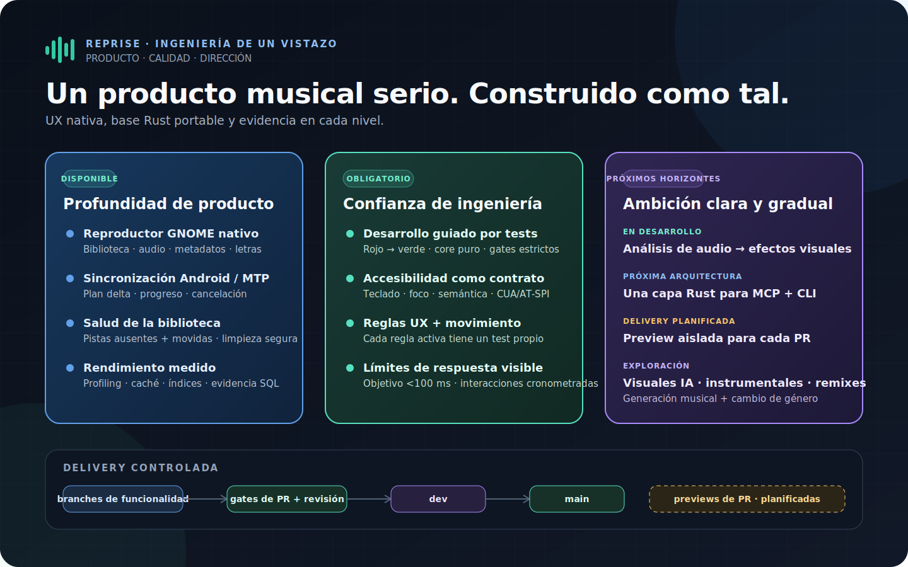
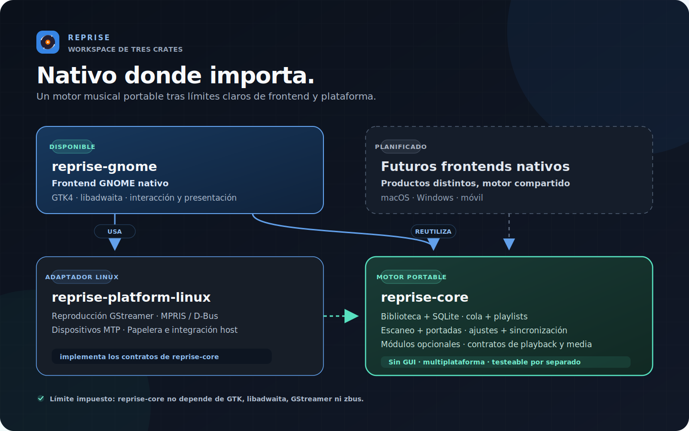
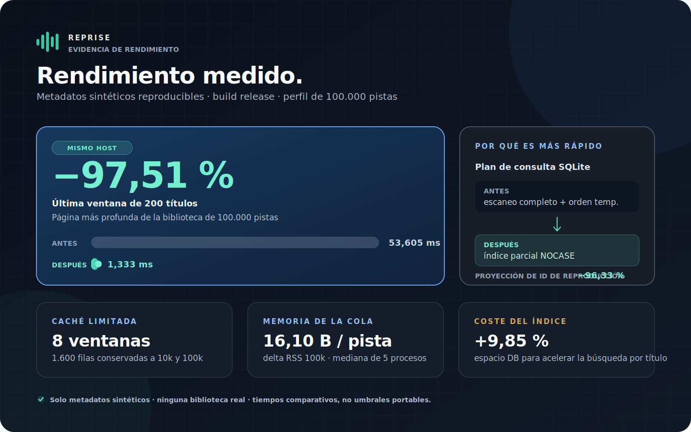

<picture>
  <source media="(prefers-color-scheme: light)" srcset="assets/wordmark-light.svg">
  
</picture>

<strong>Un reproductor de música nativo GTK4 / libadwaita para GNOME, escrito en Rust — y un banco de pruebas para un core portable con frontends nativos ligeros.</strong>

<a href="README.md">English</a> · <a href="README.de.md">Deutsch</a> · <a href="README.fr.md">Français</a> · <a href="README.it.md">Italiano</a> · <a href="README.es.md">Español</a>

Iniciado el 11 de julio de 2026 · proyecto de portfolio activo · sin versión pública todavía · evidencia actualizada el 20 de julio de 2026

Reprise está pensado para bibliotecas musicales locales: vistas virtualizadas,
herramientas serias de metadatos, estadísticas de escucha, sincronización
Android e integración profunda con GNOME. El comportamiento de dominio vive en
un core Rust independiente de la plataforma; cada plataforma conserva una
interfaz pequeña y realmente nativa.

## Ingeniería de un vistazo

## Funcionalidades disponibles

| Área | Implementado |
|---|---|
| Biblioteca | Catálogo SQLite, vistas virtualizadas, escaneos incrementales, monitorización y detección de archivos ausentes o movidos |
| Reproducción | GStreamer, gapless, crossfade, ecualizador de diez bandas, ReplayGain, cola, shuffle/repeat y navegación por waveform |
| Metadatos | Editor multipista que solo escribe campos modificados, MusicBrainz y portadas incrustadas/locales/online |
| Organización | Búsqueda completa, filtros, columnas persistentes, playlists manuales/inteligentes e importación/exportación M3U |
| Dispositivos | Navegación Android MTP y sincronización delta con progreso, cancelación, playlists y transcodificación Opus opcional |
| Seguridad | Importación Rhythmbox, restauración sin autoplay, flujos de ausentes/errores, retirada de DB y Papelera confirmada |

## Arquitectura: un core, bordes nativos

El core no depende de GTK, libadwaita, GStreamer, zbus ni GLib. Gates
automáticos bloquean SQL productivo, HTTP bloqueante y acoplamiento directo con
GStreamer en el frontend. No es una web shell compartida: datos y comportamiento
son comunes; las interacciones permanecen nativas.

## Rendimiento: medir, cambiar, comparar

Cada optimización parte de perfiles sintéticos aislados y aporta evidencia
reproducible antes/después. Profiling, planes de consulta, cachés limitadas,
presupuestos de memoria y costes de indexación forman parte del cambio.

Los tiempos son comparaciones en el mismo host, no límites portables. Caché y
memoria sí son contratos deterministas.

## Práctica de ingeniería

- **Especificación y TDD.** Decisiones escritas, rojo/verde, revisión adversaria y commits dedicados.
- **Gates estrictos.** Formato, Clippy sin warnings, Rustdoc, tests del workspace, auditoría, arquitectura, UX, motion y tests display/CSS.
- **Accesibilidad como contrato.** Teclado, foco, semántica, CUA/AT-SPI y pruebas GNOME declaran exactamente qué demuestran.
- **UX medible.** Cada regla activa tiene un test; reduced motion prevalece y el feedback visible tiene objetivos explícitos, incluido el target inferior a 100 ms.
- **Entrega controlada.** Feature branch → PR con gates → `dev` → `main` estable. Las previews aisladas para cada PR están planificadas.

## Roadmap

| Estado | Dirección | Límite |
|---|---|---|
| En desarrollo | Análisis de audio y perfiles sonoros para efectos visuales nativos | Trabajo limitado, sin bloquear el hilo de audio, alto contraste y reduced motion |
| Próxima arquitectura | MCP y CLI sobre la misma aplicación Rust probada | Capacidades explícitas, solo lectura por defecto, sin fugas de rutas o credenciales |
| Exploración | Visuales IA, nuevas canciones, versiones instrumentales, remixes y transformación de género | Procedencia clara y acción explícita; nunca mutación silenciosa de la biblioteca |

## Código y contacto

El código de producción permanece privado para conservar una opción comercial.
Este repositorio público documenta producto, arquitectura y evidencia
verificable.

**Marvin Baudach** · m.baudach@pm.me · [linkedin.com/in/marvin-baudach](https://www.linkedin.com/in/marvin-baudach)
