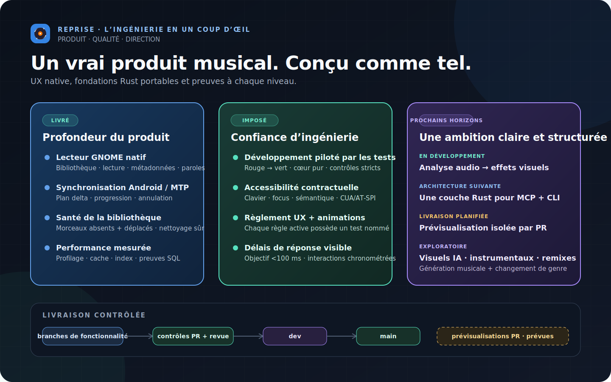
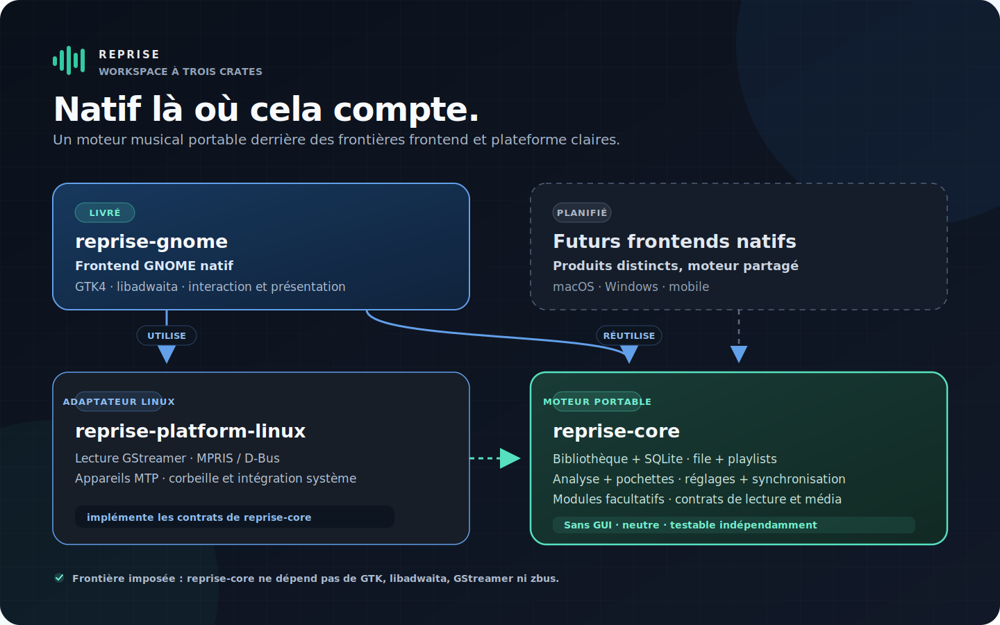

<div align="center">

<picture>
  <source media="(prefers-color-scheme: light)" srcset="assets/wordmark-light.svg">
  
</picture>

<p><strong>Un lecteur de musique natif GTK4 / libadwaita pour GNOME, écrit en Rust — et un terrain d'expérimentation pour un cœur portable doté d'interfaces natives légères.</strong></p>

<p><a href="README.md">English</a> · <a href="README.de.md">Deutsch</a> · <a href="README.fr.md">Français</a> · <a href="README.it.md">Italiano</a> · <a href="README.es.md">Español</a></p>

<p>
  
  
  
  
  
  
  
</p>

<p><sub>Démarré le 11 juillet 2026 · projet de portfolio actif · aucune version publique à ce jour · preuves actualisées le 20 juillet 2026</sub></p>

</div>

Reprise est conçu en priorité pour les bibliothèques musicales locales : vues
virtualisées pour les grandes collections, outils de métadonnées complets,
statistiques d'écoute, synchronisation Android et intégration étroite à GNOME.
Le produit constitue également une expérience d'architecture : le comportement
métier réside dans un cœur Rust indépendant de la plateforme, tandis que chaque
plateforme conserve une interface et une couche d'intégration petites et
véritablement natives.

## L’ingénierie en un coup d’œil



## Interface

<table>
  <tr>
    <td width="50%">
      
      <p align="center"><sub>Bibliothèque de morceaux — colonnes triables persistantes, panneau de métadonnées, état de la bibliothèque</sub></p>
    </td>
    <td width="50%">
      
      <p align="center"><sub>Grille d'albums — panneau de détails et accent du lecteur dérivé de la pochette</sub></p>
    </td>
  </tr>
  <tr>
    <td width="50%">
      
      <p align="center"><sub>Pages d'artistes — albums, meilleurs morceaux et historique d'écoute</sub></p>
    </td>
    <td width="50%">
      
      <p align="center"><sub>Mes statistiques — heures d'écoute, artistes et albums principaux, graphique d'activité</sub></p>
    </td>
  </tr>
</table>

<p align="center"><sub>Maquettes du système visuel, et non captures d'exécution fabriquées. Des captures de l'application réelle les remplaceront après la validation visuelle native sous GNOME.</sub></p>

## Fonctionnalités actuelles

| Domaine | Réalisé |
|---|---|
| Bibliothèque | Catalogue SQLite, vues virtualisées Morceaux/Albums/Artistes, analyses incrémentales, surveillance en direct et détection des déplacements ou fichiers manquants |
| Lecture | Pipeline GStreamer avec lecture sans interruption, fondu enchaîné, égaliseur dix bandes, ReplayGain, file d'attente, lecture aléatoire/répétition et navigation par forme d'onde |
| Métadonnées | Éditeur de tags multi-morceaux qui n'écrit que les champs modifiés, recherche MusicBrainz, pochettes intégrées/locales/en ligne |
| Recherche et organisation | Recherche sur tous les champs, filtres, colonnes personnalisées persistantes, listes de lecture manuelles/intelligentes, import/export M3U |
| Paroles et découverte | Paroles synchronisées ou statiques, recherche LRCLIB mise en cache, actualités facultatives sur les artistes et les albums |
| Bureau | Touches multimédias MPRIS, réglages rapides, notifications, métadonnées sur l'écran de verrouillage, thèmes et accent dérivé de la pochette |
| Appareils | Navigation MTP Android et synchronisation différentielle avec progression, annulation, listes de lecture et transcodage Opus facultatif |
| Services | Modules ListenBrainz et Last.fm indépendants, désactivés par défaut, avec identifiants dans le trousseau et files hors ligne persistantes |
| Migration et sécurité | Import Rhythmbox ponctuel, restauration de session sans lecture automatique, traitement des fichiers manquants/erreurs d'import, retrait limité à la base de données et mise à la corbeille confirmée |

## Architecture : un cœur, des périphéries natives



| Crate | Responsabilité | Frontière imposée |
|---|---|---|
| `reprise-core` | Bibliothèque, façades de base de données, sémantique de file d'attente, listes de lecture, réglages, modules et contrats de plateforme | Aucune dépendance à GTK, libadwaita, GStreamer, zbus ou GLib |
| `reprise-gnome` | Composition GTK4/libadwaita, interactions natives, accessibilité, thèmes et présentation | Aucun SQL en production, HTTP bloquant, couplage direct à GStreamer ou code unsafe non validé |
| `reprise-platform-linux` | Implémentations Linux pour l'audio, l'intégration multimédia, les appareils, l'extraction de formes d'onde et la corbeille | Implémente les contrats du cœur ; le code d'interface reçoit des abstractions |

Il ne s'agit volontairement pas d'une enveloppe web partagée. Le cœur Rust
possède les données et le comportement ; les interfaces propres aux plateformes
possèdent les modèles d'interaction natifs. L'application GTK démontre cette
frontière aujourd'hui, tandis que les autres interfaces restent une orientation
de la feuille de route et non une fonctionnalité annoncée comme livrée.

## Performance : mesurer, modifier, comparer

Le travail sur les performances commence par des preuves générées, non par
l'intuition. Les benchmarks en mode release créent des profils de métadonnées
isolés de 10 000 et 100 000 morceaux, conservent des fichiers JSON stables ainsi
qu'un manifeste de commit/build, refusent les répertoires de sortie existants et
ne touchent jamais aux fichiers musicaux ni à une véritable base utilisateur.

La première optimisation guidée par benchmark a remplacé un parcours complet
avec tri temporaire par un index partiel de titres en `NOCASE`. La comparaison
acceptée sur la même machine avec 100 000 morceaux a mesuré :


| Mesure | Avant | Après | Résultat |
|---|---:|---:|---:|
| Dernière fenêtre de 200 titres | 53 605 µs | 1 333 µs | **-97,51 %** |
| Projection des identifiants de lecture | 8 125 µs | 298 µs | **-96,33 %** |
| Plan SQLite | parcours complet + B-tree temporaire | parcours par index partiel | tri temporaire supprimé |
| Taille de la base | référence | +2 379 776 octets | **+9,85 %**, compromis explicite |

Le modèle de liste reste par ailleurs limité à **8 fenêtres SQL mises en cache
et 1 600 lignes conservées**, sans variation entre 10 000 et 100 000 morceaux.
Cinq processus neufs ont mesuré 100 000 entrées de file avec un delta RSS de
1 609 728 octets, soit **16,10 octets/morceau**.

```sh
scripts/performance-baseline.sh /tmp/reprise-before
# implémenter la modification candidate, puis mesurer son commit
scripts/performance-baseline.sh /tmp/reprise-after
scripts/performance-query-compare.sh \
  /tmp/reprise-before /tmp/reprise-after > /tmp/query-comparison.json
```

La suite d'exécution complète observe également le démarrage de l'application
installée, les lignes/cellules GTK réalisées, le nombre de fournisseurs et de
modèles, la mémoire de la file et la réactivité du défilement piloté par CUA.
Elle échoue explicitement lorsque les sockets privés D-Bus/Xvfb/AT-SPI sont
indisponibles et ne se rabat jamais sur le bureau réel. Les durées constituent
des comparaisons sur une même machine, pas des seuils CI portables ; les limites
déterministes de cache et de mémoire sont des tests stricts.

## En chiffres

| Mesure | Preuve actuelle |
|---|---:|
| Code Rust | 88 789 lignes |
| — code produit | 58 053 lignes |
| — code de test | 30 736 lignes |
| Validation du workspace | 1 482 tests réussis : 758 cœur · 669 GNOME · 55 plateforme Linux |
| Tests en conditions contrôlées | 139 séparés de l'exécution standard, dont 138 tests d'affichage/hôte GNOME |
| Contrats UX | 60 règles actives, chacune exigeant un test nommé d'après la règle |
| Contrôles qualité | 12 contrôles de fusion stricts, plus les vérifications de livraison/paquet |

<sub>Les lignes Rust ont été comptées sur le commit de clôture des performances avec l'analyseur reproductible et conscient de <code>#[cfg(test)]</code> utilisé par le dépôt de l'application/CV. Les lignes vides et les commentaires seuls sont exclus ; le code produit et le code de test sont présentés séparément.</sub>

## Pratiques d'ingénierie

- **Pilotage par spécifications et tests.** Tout travail substantiel commence
  par des décisions écrites et un plan de tâches. Chaque tâche suit une boucle
  rouge/verte et reçoit une revue contradictoire du diff avant son commit dédié.
- **Douze contrôles de fusion stricts.** Formatage, Clippy rigoureux sur toutes
  les cibles, Rustdoc sans avertissement, suite complète du workspace, audit des
  dépendances, politique d'architecture, traçabilité UX, jetons d'animation et
  tests isolés d'affichage/CSS sont appliqués ensemble.
- **Un cœur profond, contrôlé mécaniquement.** `cargo tree` prouve la pureté du
  cœur. Le linter d'architecture maintient aussi les fichiers Rust sous 800
  lignes, limite les racines de composition UI et bloque les couplages qui
  rendraient coûteuse une autre interface native.
- **UX et accessibilité comme contrats.** Le règlement couvre la lecture, le
  clavier/focus, les retours, les infobulles, l'accessibilité et les animations.
  Chaque règle active possède un test nommé. Les sept règles d'animation sont
  actives ; la réduction des animations prime sur toute décoration. Les délais
  de retour visible — dont l'objectif d'interaction inférieur à 100 ms — sont
  contractuels ; preuves manuelles et automatisées restent distinctes.
- **Des niveaux de vérification honnêtes.** Tests purs du cœur, tests GTK dans
  un processus, parcours au pointeur sous Xvfb, parcours sémantiques CUA/AT-SPI
  et contrôles manuels GNOME/matériel indiquent chacun ce qu'ils peuvent ou ne
  peuvent pas prouver.
- **Optimisation mesurée.** Les changements de performance incluent des
  analyses avant/après reproductibles, les plans de requête, des caches et
  budgets mémoire bornés, ainsi que les compromis explicites des index.
- **Livraison contrôlée.** Les branches de fonctionnalité passent les contrôles
  de PR vers `dev`, puis vers `main` stable. Une prévisualisation isolée pour
  chaque PR constitue la prochaine amélioration planifiée.
- **Les outils accompagnent le travail ; les contrôles valident le résultat.**
  Claude Code et Codex aident à réaliser des tâches clairement délimitées à
  partir d’exigences écrites. Une modification n’est fusionnée qu’après la
  réussite des tests et contrôles qualité requis.

## Feuille de route : le même cœur au-delà du lecteur actuel

Les éléments suivants sont des orientations d'architecture, pas des
fonctionnalités livrées.

| Orientation | Interface prévue | Contrainte non négociable |
|---|---|---|
| **En développement — visuels pilotés par l’analyse** | Les preuves audio locales et profils sonores pilotent un moteur de rendu natif | Travail borné, aucun blocage du thread audio, solution à fort contraste, priorité à la réduction/désactivation des animations |
| **Architecture suivante — MCP + CLI** | Des adaptateurs légers utilisent une même couche applicative Rust pour la bibliothèque, les listes, la file et la lecture | Même comportement testé dans chaque adaptateur ; capacités explicites, lecture seule par défaut, aucune fuite de chemin ou d’identifiant |
| **Exploratoire — audio + visuels génératifs** | Modules facultatifs indépendants du fournisseur pour visuels IA, nouveaux morceaux, versions instrumentales, remixes et transformations de genre | Provenance et action utilisateur explicite ; aucune mutation silencieuse de la bibliothèque |
| **Interfaces natives légères** | SwiftUI, WinUI, mobile ou autre toolkit Linux réutilise le cœur Rust MIT et fournit les implémentations de plateforme | Modèles d'interaction natifs plutôt qu'une UI au plus petit dénominateur commun |
| **Distribution** | Paquet Flatpak/Flathub, finalisation de gettext et véritable validation GNOME | Aucune annonce de version avant les preuves de paquet, traduction, affichage, audio, portail et matériel |

Le registre de modules existant et les contrats de lecture, média et forme
d'onde constituent les interfaces initiales. Les comportements expérimentaux
d'IA et d'agents restent hors du modèle métier du cœur jusqu'à ce que leurs
interfaces et règles de sécurité soient démontrées.

## Source et contact

Le code source de production reste privé afin de préserver une option
commerciale. Ce dépôt public documente le produit, son architecture et des
preuves d'ingénierie vérifiables ; une présentation du code commence par une
simple conversation.

**Marvin Baudach** · m.baudach@pm.me · [linkedin.com/in/marvin-baudach](https://www.linkedin.com/in/marvin-baudach)

---

<p align="center"><sub>© 2026 Marvin Baudach · m.baudach@pm.me · <a href="https://www.linkedin.com/in/marvin-baudach">linkedin.com/in/marvin-baudach</a></sub></p>
