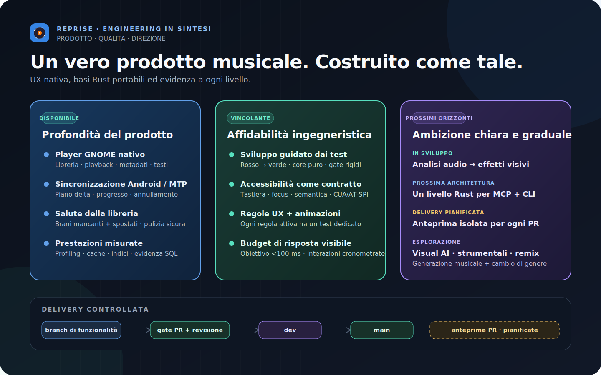
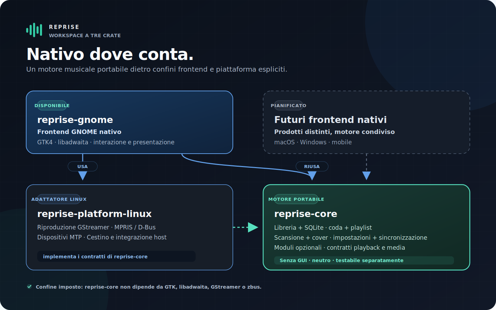

<picture>
  <source media="(prefers-color-scheme: light)" srcset="assets/wordmark-light.svg">
  
</picture>

<strong>Un lettore musicale nativo GTK4 / libadwaita per GNOME, scritto in Rust — e un banco di prova per un core portabile con frontend nativi leggeri.</strong>

<a href="README.md">English</a> · <a href="README.de.md">Deutsch</a> · <a href="README.fr.md">Français</a> · <a href="README.it.md">Italiano</a> · <a href="README.es.md">Español</a>

Avviato l’11 luglio 2026 · progetto portfolio attivo · nessuna release pubblica · evidenza aggiornata il 20 luglio 2026

Reprise nasce per le librerie musicali locali: viste virtualizzate, strumenti
seri per i metadati, statistiche d’ascolto, sincronizzazione Android e profonda
integrazione GNOME. Il comportamento di dominio vive in un core Rust
indipendente dalla piattaforma; ogni piattaforma mantiene un’interfaccia
piccola e realmente nativa.

## Engineering in sintesi

## Funzionalità disponibili

| Area | Realizzato |
|---|---|
| Libreria | Catalogo SQLite, viste virtualizzate, scansioni incrementali, monitoraggio e rilevamento di file mancanti o spostati |
| Riproduzione | GStreamer, gapless, crossfade, equalizzatore a dieci bande, ReplayGain, coda, shuffle/repeat e waveform seeking |
| Metadati | Editor multi-brano che scrive solo i campi modificati, MusicBrainz e copertine incorporate/locali/online |
| Organizzazione | Ricerca completa, filtri, colonne persistenti, playlist manuali/smart e import/export M3U |
| Dispositivi | Navigazione Android MTP e sincronizzazione delta con progresso, annullamento, playlist e transcodifica Opus opzionale |
| Sicurezza | Import Rhythmbox, ripristino senza autoplay, flussi per file mancanti/errori, rimozione dal DB e Cestino confermato |

## Architettura: un core, bordi nativi

Il core non dipende da GTK, libadwaita, GStreamer, zbus o GLib. Gate automatici
impediscono SQL produttivo, HTTP bloccante e accoppiamento diretto a GStreamer
nel frontend. Non è una web shell condivisa: dati e comportamento sono comuni,
le interazioni restano native.

## Prestazioni: misurare, cambiare, confrontare

Ogni ottimizzazione parte da profili sintetici isolati e produce evidenza
prima/dopo riproducibile. Profiling, piani query, cache limitate, budget di
memoria e trade-off degli indici fanno parte della modifica.

I tempi sono confronti sullo stesso host, non soglie portabili. Cache e memoria
sono invece contratti deterministici.

## Pratica ingegneristica

- **Specifica e TDD.** Decisioni scritte, rosso/verde, revisione avversaria e commit dedicati.
- **Gate rigidi.** Formatting, Clippy senza warning, Rustdoc, test workspace, audit, architettura, UX, motion e test display/CSS.
- **Accessibilità come contratto.** Tastiera, focus, semantica, CUA/AT-SPI e verifiche GNOME dichiarano esattamente cosa provano.
- **UX misurabile.** Ogni regola attiva ha un test; reduced motion prevale e il feedback visibile ha obiettivi espliciti, incluso il target sotto 100 ms.
- **Delivery controllata.** Feature branch → PR con gate → `dev` → `main` stabile. Le anteprime isolate per ogni PR sono pianificate.

## Roadmap

| Stato | Direzione | Limite |
|---|---|---|
| In sviluppo | Analisi audio e profili sonori per effetti visivi nativi | Lavoro limitato, niente blocchi del thread audio, alto contrasto e reduced motion |
| Architettura successiva | MCP e CLI sopra la stessa applicazione Rust testata | Capability esplicite, read-only di default, nessuna fuga di percorsi o credenziali |
| Esplorazione | Visual AI, nuovi brani, versioni strumentali, remix e trasformazione di genere | Provenienza chiara e azione esplicita; nessuna mutazione silenziosa della libreria |

## Sorgente e contatti

Il sorgente di produzione resta privato per conservare un’opzione commerciale.
Questo repository pubblico documenta prodotto, architettura ed evidenza
verificabile.

**Marvin Baudach** · m.baudach@pm.me · [linkedin.com/in/marvin-baudach](https://www.linkedin.com/in/marvin-baudach)
