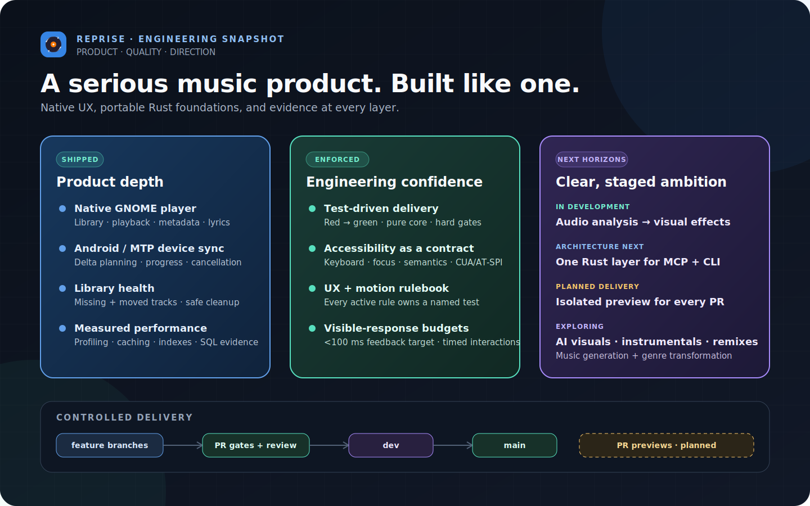
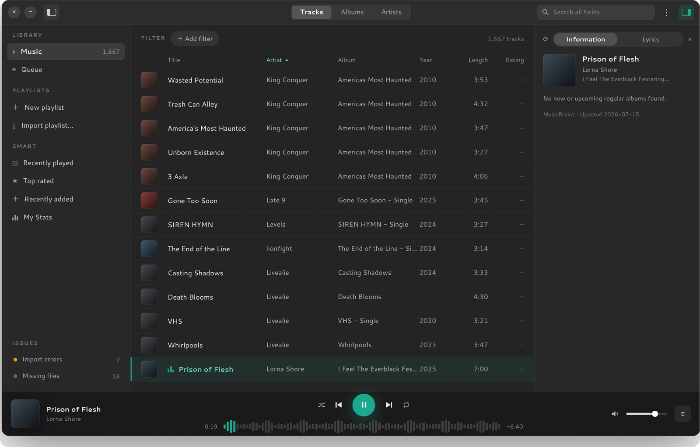
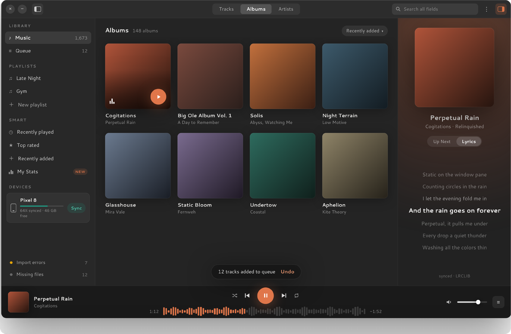
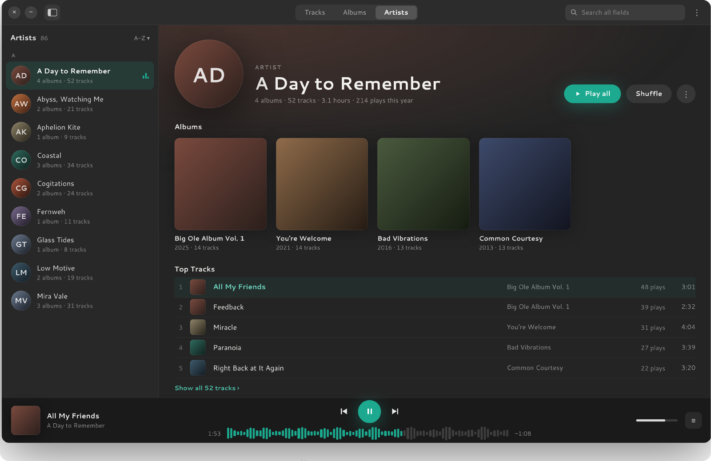
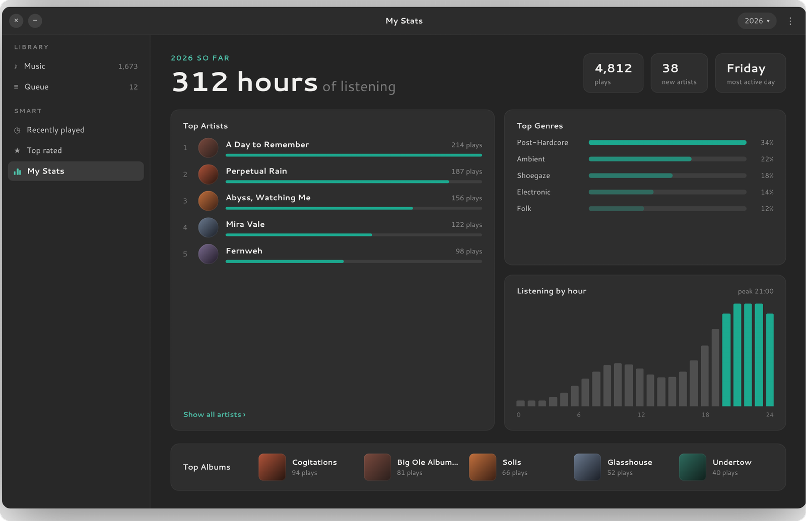
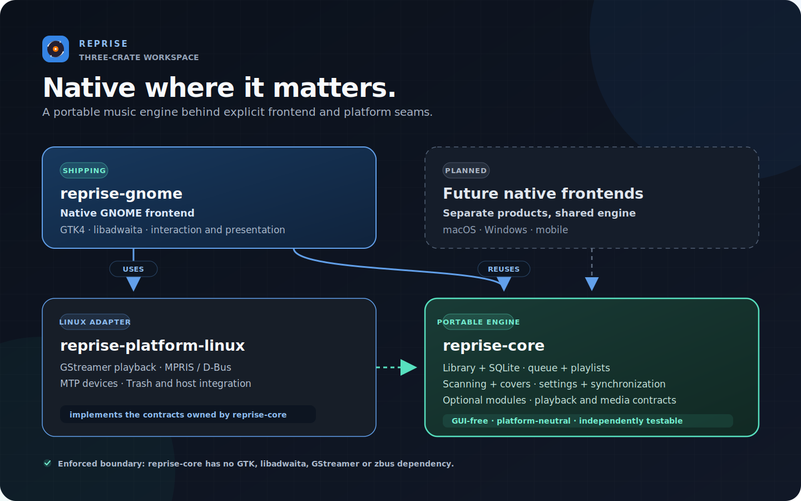

<div align="center">

<picture>
  <source media="(prefers-color-scheme: light)" srcset="assets/wordmark-light.svg">
  
</picture>

<p><strong>A native GTK4 / libadwaita music player for GNOME, written in Rust — and a test bed for one portable core with thin native frontends.</strong></p>

<p><a href="README.md">English</a> · <a href="README.de.md">Deutsch</a> · <a href="README.fr.md">Français</a> · <a href="README.it.md">Italiano</a> · <a href="README.es.md">Español</a></p>

<p>
  
  
  
  
  
  
  
</p>

<p><sub>Started on 11 July 2026 · active portfolio project · no public release yet · evidence updated 20 July 2026</sub></p>

</div>

Reprise is built local-library first: virtualized views over large collections,
serious metadata tooling, listening statistics, Android sync, and tight GNOME
integration. The product is also an architecture experiment: domain behavior
lives in a platform-neutral Rust core, while every platform should keep a
small, genuinely native UI and integration layer.

## Engineering at a glance



## Interface

<table>
  <tr>
    <td width="50%">
      
      <p align="center"><sub>Track library — sortable persisted columns, metadata panel, library health</sub></p>
    </td>
    <td width="50%">
      
      <p align="center"><sub>Album grid — detail panel, player accent derived from the cover art</sub></p>
    </td>
  </tr>
  <tr>
    <td width="50%">
      
      <p align="center"><sub>Artist pages — albums, top tracks, play history</sub></p>
    </td>
    <td width="50%">
      
      <p align="center"><sub>My Stats — listening hours, top artists and albums, activity chart</sub></p>
    </td>
  </tr>
</table>

<p align="center"><sub>Design-system previews, not fabricated runtime screenshots. Captures of the running app will replace them after the native GNOME visual pass.</sub></p>

## Product surface

| Area | Built |
|---|---|
| Library | SQLite-backed catalog, virtualized Tracks/Albums/Artists views, incremental scans, live watching, move and missing-file detection |
| Playback | GStreamer pipeline with gapless, crossfade, ten-band equalizer, ReplayGain, queue, shuffle/repeat, and waveform seeking |
| Metadata | Multi-track tag editor that writes only changed fields, MusicBrainz lookup, embedded/folder/online covers |
| Search and organization | Full-field search, filter chips, persistent custom columns, manual/smart playlists, M3U import/export |
| Lyrics and discovery | Synchronized/static lyrics, cached LRCLIB lookup, optional artist and album news |
| Desktop | MPRIS media keys, quick settings, notifications, lock-screen metadata, themes, cover-derived accent |
| Devices | Android MTP browsing and delta sync with progress, cancellation, playlists, and optional Opus transcoding |
| Services | Independent default-off ListenBrainz and Last.fm modules with keyring credentials and durable offline queues |
| Migration and safety | One-shot Rhythmbox import, no-autoplay session restore, missing/import issue flows, database-only remove, confirmed Trash |

## Architecture: one core, native edges



| Crate | Responsibility | Enforced boundary |
|---|---|---|
| `reprise-core` | Library, database facades, queue semantics, playlists, settings, modules, and platform contracts | No GTK, libadwaita, GStreamer, zbus, or GLib dependencies |
| `reprise-gnome` | GTK4/libadwaita composition, native interactions, accessibility, theming, and presentation | No productive SQL, blocking HTTP, direct GStreamer coupling, or unreviewed unsafe code |
| `reprise-platform-linux` | Linux implementations for audio, media integration, devices, waveform extraction, and Trash | Implements the core contracts; UI code receives interfaces |

This is deliberately not a shared web shell. The Rust core owns data and
behavior; platform-specific frontends own native interaction patterns. The
current GTK app proves the boundary today, while additional frontends remain a
roadmap direction rather than a shipped claim.

## Performance: measure, change, compare

Performance work starts with generated evidence, not intuition. Release-mode
benchmarks create isolated 10,000- and 100,000-track metadata profiles, retain
stable JSON plus a commit/build manifest, reject existing output directories,
and never touch music files or a real user database.

The first benchmark-driven optimization replaced a full scan plus temporary
sort with a partial `NOCASE` title index. The accepted same-host 100,000-track
comparison measured:


| Measurement | Before | After | Result |
|---|---:|---:|---:|
| Final 200-row title window | 53,605 µs | 1,333 µs | **-97.51%** |
| Playback-ID projection | 8,125 µs | 298 µs | **-96.33%** |
| SQLite plan | full scan + temporary B-tree | partial index scan | temporary sort removed |
| Database size | baseline | +2,379,776 bytes | **+9.85%** explicit trade-off |

The track-list model is separately held to **8 cached SQL windows and 1,600
retained rows**, unchanged between 10,000 and 100,000 tracks. Five fresh
processes measured 100,000 queue entries at 1,609,728 bytes RSS delta, or
**16.10 bytes/track**.

```sh
scripts/performance-baseline.sh /tmp/reprise-before
# implement the candidate change, then measure its commit
scripts/performance-baseline.sh /tmp/reprise-after
scripts/performance-query-compare.sh \
  /tmp/reprise-before /tmp/reprise-after > /tmp/query-comparison.json
```

The full runtime suite also observes installed-app startup, realized GTK
rows/cells, provider/model counts, queue memory, and CUA-driven scroll response.
It fails closed when private D-Bus/Xvfb/AT-SPI sockets are unavailable and never
falls back to a live desktop. Timings are same-host comparison evidence, not
portable CI thresholds; deterministic cache and memory budgets are hard tests.

## By the numbers

| Metric | Current evidence |
|---|---:|
| Rust code | 88,789 lines |
| — product code | 58,053 lines |
| — test code | 30,736 lines |
| Workspace gate | 1,482 passing tests: 758 core · 669 GNOME · 55 Linux platform |
| Controlled-condition tests | 139 separated from the default run, including 138 GNOME display/host tests |
| UX contracts | 60 active rules, each requiring a rule-named test |
| Quality gates | 12 hard merge gates plus release/package checks |

<sub>Rust lines were counted on the committed performance close-out with the reproducible, <code>#[cfg(test)]</code>-aware analyzer used by the application/CV repository. Blank and comment-only lines are excluded; product and test code are reported separately.</sub>

## Engineering practice

- **Spec- and test-driven.** Substantial work starts from written decisions and
  a task plan. Each task follows a red/green loop and gets an adversarial diff
  review before its dedicated commit.
- **Twelve hard merge gates.** Formatting, strict all-target Clippy, warning-
  free Rustdoc, the full workspace suite, dependency audit, architecture
  policy, UX traceability, motion tokens, and isolated display/CSS checks are
  enforced together.
- **A deep core, checked mechanically.** `cargo tree` proves core purity. The
  architecture linter also keeps Rust files below 800 lines, limits UI
  composition roots, and blocks coupling patterns that would make another
  native frontend expensive.
- **UX and accessibility as contracts.** The rulebook covers playback,
  keyboard/focus behavior, feedback, tooltips, reachability, and motion. Every
  active rule owns a named test. All seven motion rules are active; reduced
  motion overrides decorative animation. Visible-feedback targets — including
  the <100 ms interaction goal — are explicit contracts, with manual and
  automated evidence kept distinct.
- **Honest verification layers.** Pure core tests, one-process GTK tests,
  pointer-driven Xvfb flows, semantic CUA/AT-SPI flows, and manual GNOME/
  hardware checks each state what they can and cannot prove.
- **Measured optimization.** Performance changes carry reproducible before/
  after analysis, query-plan evidence, bounded caches and memory, and explicit
  indexing trade-offs instead of unsupported speed claims.
- **Controlled delivery.** Feature branches pass pull-request gates into
  `dev`, then stable `main`. Isolated previews for every PR are the next
  planned delivery improvement.
- **Agent-orchestrated, gate-controlled.** Claude Code and Codex implement
  bounded tasks against the written contracts. Tests and gates, not generated
  confidence, are the merge authority.

## Roadmap: the same core beyond today’s player

The following are architectural directions, not shipped features.

| Direction | Intended seam | Non-negotiable constraint |
|---|---|---|
| **In development — analysis-driven visuals** | Local audio evidence and sound profiles drive a native renderer | Bounded work, no audio-thread blocking, high-contrast fallback, reduced-motion/off wins |
| **Architecture next — MCP + CLI** | Thin adapters use one shared Rust application layer for library, playlist, queue, and playback behavior | Same tested behavior in every adapter; explicit capabilities, read-only by default, no path/credential leakage |
| **Exploratory — generative audio + visuals** | Provider-neutral optional modules for AI visuals, new songs, instrumentals, remixes, and genre transformation | Provenance and explicit user action; never silent library mutation |
| **Thin native frontends** | SwiftUI, WinUI, mobile, or another Linux toolkit reuses the MIT Rust core and supplies platform implementations | Native interaction patterns instead of lowest-common-denominator UI |
| **Distribution** | Flatpak/Flathub packaging, gettext completion, and a real GNOME release pass | No release claim before package, translation, display, audio, portal, and hardware evidence is complete |

The existing module registry and playback/media/waveform contracts are the
starting seams. Experimental AI and agent behavior stays outside the core
domain model until those interfaces and safety rules are proven.

## Source and contact

The production source is private to preserve a commercial option. This public
repository documents the product, architecture, and verifiable engineering
evidence; a code walkthrough is a conversation away.

**Marvin Baudach** · m.baudach@pm.me · [linkedin.com/in/marvin-baudach](https://www.linkedin.com/in/marvin-baudach)

---

<p align="center"><sub>© 2026 Marvin Baudach · m.baudach@pm.me · <a href="https://www.linkedin.com/in/marvin-baudach">linkedin.com/in/marvin-baudach</a></sub></p>
