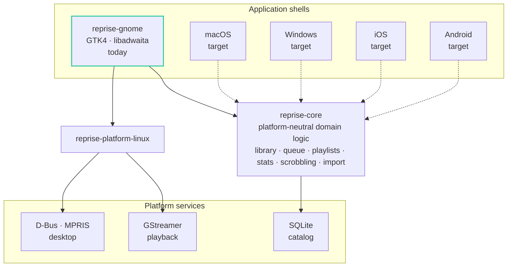

<picture>
  <source media="(prefers-color-scheme: light)" srcset="assets/wordmark-light.svg">
  
</picture>

<strong>A native GTK4 / libadwaita music player for GNOME, written in Rust — a modern successor to Rhythmbox.</strong>

  
  
  
  
  
  

Reprise is built local-library first: fast virtualized views over large collections, serious metadata tooling, listening statistics, and tight desktop integration — with all domain logic in a platform-neutral Rust core.

## Interface

<table>
  <tr>
    <td width="50%">
      
      
Track library — sortable persisted columns, metadata panel, library health

    </td>
    <td width="50%">
      
      
Album grid — detail panel, player accent derived from the cover art

    </td>
  </tr>
  <tr>
    <td width="50%">
      
      
Artist pages — albums, top tracks, play history

    </td>
    <td width="50%">
      
      
My Stats — listening hours, top artists and albums, activity chart

    </td>
  </tr>
</table>

Interface previews from the design system — screenshots of the running app are landing here shortly.

## Features

| Area | Built |
|---|---|
| Library | SQLite-backed catalog, virtualized column views (Tracks · Albums · Artists), incremental scans with file-move detection |
| Playback | GStreamer pipeline: gapless, crossfade, 10-band equalizer, ReplayGain, waveform seek bar with per-track peaks |
| Queue | Persistent play queue, shuffle and repeat, full session restore |
| Playlists | Manual and smart playlists, M3U import/export |
| Search & filter | Full-text search, filter chips, per-column sorting with persisted custom layouts |
| Metadata | Batch tag editor with MusicBrainz lookup, cover-art fetching |
| Lyrics | Synced and static lyrics with LRCLIB fetching |
| Statistics | Listening-time dashboard: hours, top artists and albums, 12-month activity chart |
| Scrobbling | Last.fm and ListenBrainz, offline queue, connection testing |
| Desktop | MPRIS media keys and lock-screen metadata, multiple named dark themes, cover-derived accent color |
| Devices | Android sync over MTP with delta computation and optional Opus transcoding |
| Migration | One-shot Rhythmbox import: library, play counts, ratings, playlists |

## Architecture

One platform-neutral core, thin native shells. The GNOME app is the first shell — not the boundary of the design.

| Crate | Role | Rust code |
|---|---|---|
| `reprise-core` | 100 % of the domain logic — library, queries, playlists, queue semantics, stats, scrobbling, import. No GUI dependencies. | 17.7k lines |
| `reprise-gnome` | The GTK4/libadwaita shell — views, widgets, theming. No domain logic. | 39.5k lines |
| `reprise-platform-linux` | GStreamer playback and D-Bus/MPRIS integration. | 2.4k lines |

## By the numbers

| Metric | Value |
|---|---|
| Rust code | 59.7k lines across 244 files in 3 crates |
| — application code | 40,634 lines |
| — test code | 19,107 lines (32 % of the codebase) |
| Test functions | 1,101 — including 76 windowed GTK tests, each run process-isolated |
| Core crate test ratio | more test code than application code (9.0k vs 8.8k lines) |
| Documentation | 7.1k lines of rustdoc comments |

Counted 2026-07-16 on the main branch with <code>tokei</code> (code lines, excluding blanks and comments); the application/test split uses a <code>#[cfg(test)]</code>-aware classifier over the same tree.

## Engineering practice

- **Spec-driven.** Substantial features start as written specs and design documents in the repository; implementation follows the spec.
- **Test-driven.** Domain logic is testable without GTK by construction. Windowed GTK tests run one-process-per-test; pointer-driven end-to-end flows run headlessly under Xvfb with a fake audio sink.
- **Hard gates on every merge.** rustfmt, Clippy with warnings denied plus a curated pedantic lint set, rustdoc warnings-as-errors, and the full workspace suite. Release builds add display-test, end-to-end, packaging, and translation checks.
- **Agent-orchestrated.** The codebase is built end-to-end with AI coding agents (Claude Code and Codex), directed task-by-task against written specs — the test suite and the lint gates are the merge authority.

## Roadmap

- Flatpak packaging and a Flathub release (desktop entry and AppStream metadata are already in-tree)
- First public release once Rhythmbox migration and packaging are polished
- Deeper artist pages: biography, tour dates, new-release tracking
- A second shell (macOS) as the proof of the core boundary; i18n rollout (gettext in place, German first)

## Source & contact

The source is private to keep a commercial option open — a full code walkthrough is a conversation away.

**Marvin Baudach** · m.baudach@pm.me · [linkedin.com/in/marvin-baudach](https://www.linkedin.com/in/marvin-baudach)

---

© 2026 Marvin Baudach · m.baudach@pm.me · <a href="https://www.linkedin.com/in/marvin-baudach">linkedin.com/in/marvin-baudach</a>

