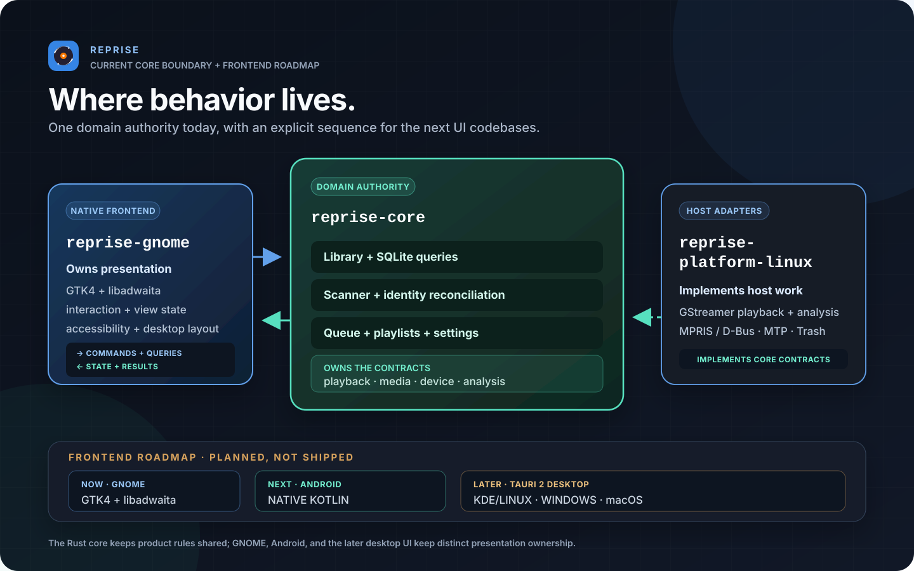
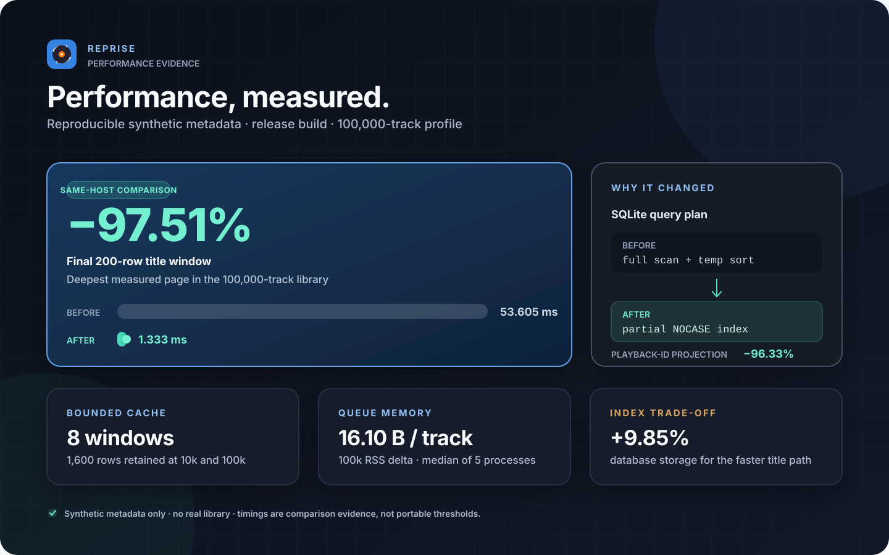

<div align="center">

<p><sub>Impact-Site-Verification: 69d5267a-19f8-4452-a03b-a0908549e51b</sub></p>

<picture>
  <source media="(prefers-color-scheme: light)" srcset="assets/wordmark-light.svg">
  
</picture>

<p><strong>A native GTK4 / libadwaita music player for GNOME, written in Rust — and a test bed for one portable core with thin native frontends.</strong></p>

<p><a href="README.md">English</a> · <a href="README.de.md">Deutsch</a></p>

<p>
  
  
  
  
  
  
  
</p>

<p><sub>Started on 11 July 2026 · active portfolio project · no public release yet · evidence updated 27 July 2026</sub></p>

</div>

Reprise is built local-library first: virtualized views over large collections,
serious metadata tooling, listening statistics, Android sync, and tight GNOME
integration. The product is also an architecture experiment: domain behavior
lives in a platform-neutral Rust core, while every platform should keep a
small, genuinely native UI and integration layer.

## Interface

<table>
  <tr>
    <td width="50%">
      
      <p align="center"><sub>Library — any-field filter over 1,702 tracks, persisted sortable columns, live queue</sub></p>
    </td>
    <td width="50%">
      
      <p align="center"><sub>Song Visuals — audio-reactive panel driven by the live playback spectrum</sub></p>
    </td>
  </tr>
  <tr>
    <td width="50%">
      
      <p align="center"><sub>My Stats — listening hours, best week, most played band and songs</sub></p>
    </td>
    <td width="50%">
      
      <p align="center"><sub>Preferences — every online integration is a separate opt-in module</sub></p>
    </td>
  </tr>
</table>

<p align="center"><sub>Captures of the running app on GNOME (dark, default <em>Perpetual Rain</em> theme), taken against a real 1,702-track library.</sub></p>

## Product surface

| Area | Built |
|---|---|
| Library | SQLite-backed catalog, a virtualized track table with album/artist/genre scopes, rolling Recently Added, incremental scans, live watching, and move/missing detection |
| Playback and visuals | GStreamer gapless/crossfade, equalizer, ReplayGain, queue, shuffle/repeat, waveform seeking, and 64 neon bars driven by a pre-ReplayGain CAVA PCM pipeline |
| Metadata and covers | Multi-track editing that writes only changed fields, MusicBrainz lookup, embedded/folder/Cover Art Archive covers, and album-wide cover consistency without writing music files |
| Search and organization | Full-field search, filter chips, persistent custom columns including Added, manual/smart playlists, and M3U import/export |
| Stats and lyrics | A period-aware listening story with trends, best week, bands, songs and genres; synchronized/static lyrics with cached LRCLIB lookup |
| Podcasts and radio | RSS and YouTube subscriptions, conditional refresh/downloads, resume and played state, reversible episode removal, plus Radio Browser/manual stations with external playback and MPRIS |
| Concerts and releases | Opt-in concert and new-release discovery with persisted filters, background refresh, dedicated views, and one shared Updates surface |
| Desktop and services | MPRIS media keys, quick settings, notifications, lock-screen metadata, themes, cover-derived accent, and independent ListenBrainz/Last.fm modules with keyring credentials and offline queues |
| Android devices | Playlist-mirroring MTP delta sync with storage/speed/progress, cancellation, safe managed-root removals, and optional 256 kbit/s Opus transcoding |
| Instrumental versions | Experimental opt-in stem separation through a separately packaged worker, with verified runtime readiness, staging previews, save/discard flows, and durable AI provenance |
| CLI and MCP adapters | Headless library/search/playlist/scan/instrumental commands plus capability-gated, path-safe MCP access to playlists, sources, discovery, device sync, instrumentals, and optional playback |
| Migration and safety | One-shot Rhythmbox import, no-autoplay session restore, missing/import issue flows, database-only remove, and confirmed Trash |

## Architecture: one core, native edges



| Crate | Responsibility | Enforced boundary |
|---|---|---|
| `reprise-core` | Library, database facades, queue semantics, playlists, settings, modules, and platform contracts | No GTK, libadwaita, GStreamer, zbus, or GLib dependencies |
| `reprise-gnome` | GTK4/libadwaita composition, native interactions, accessibility, theming, and presentation | No productive SQL, blocking HTTP, direct GStreamer coupling, or unreviewed unsafe code |
| `reprise-platform-linux` | Linux implementations for audio, media integration, devices, waveform extraction, and Trash | Implements the core contracts; UI code receives interfaces |
| `reprise-cli` | Headless commands over core facades for library, playlists, scanning, and instrumental jobs | No GUI dependencies or duplicated product rules |
| `reprise-mcp` | Local stdio tools and path-safe resources with explicit read/write capabilities | No productive SQL, implicit mutation, path leakage, or credential leakage |
| `reprise-stems` | Portable stem-separation engine and verified model/runtime provisioning | No GUI, database, or playback coupling |

This is deliberately not a shared web shell. The Rust core owns data and
behavior; platform-specific frontends own native interaction patterns. The
current GTK app proves the boundary today, while additional frontends remain a
roadmap direction rather than a shipped claim.

## Performance: measure, change, compare

Performance work starts with generated evidence, not intuition. Release-mode
benchmarks create isolated 10,000- and 100,000-track metadata profiles, retain
stable JSON plus a commit/build manifest, reject existing output directories,
and never touch music files or a real user database.

The first benchmark-driven optimization replaced a full scan plus temporary
sort with a partial `NOCASE` title index. The accepted same-host 100,000-track
comparison measured:



| Measurement | Before | After | Result |
|---|---:|---:|---:|
| Final 200-row title window | 53,605 µs | 1,333 µs | **-97.51%** |
| Playback-ID projection | 8,125 µs | 298 µs | **-96.33%** |
| SQLite plan | full scan + temporary B-tree | partial index scan | temporary sort removed |
| Database size | baseline | +2,379,776 bytes | **+9.85%** explicit trade-off |

The track-list model is separately held to **8 cached SQL windows and 1,600
retained rows**, unchanged between 10,000 and 100,000 tracks. Five fresh
processes measured 100,000 queue entries at 1,609,728 bytes RSS delta, or
**16.10 bytes/track**.

```sh
scripts/performance-baseline.sh /tmp/reprise-before
# implement the candidate change, then measure its commit
scripts/performance-baseline.sh /tmp/reprise-after
scripts/performance-query-compare.sh \
  /tmp/reprise-before /tmp/reprise-after > /tmp/query-comparison.json
```

The full runtime suite also observes installed-app startup, realized GTK
rows/cells, provider/model counts, queue memory, and CUA-driven scroll response.
It fails closed when private D-Bus/Xvfb/AT-SPI sockets are unavailable and never
falls back to a live desktop. Timings are same-host comparison evidence, not
portable CI thresholds; deterministic cache and memory budgets are hard tests.

## By the numbers

| Metric | Current evidence |
|---|---:|
| Rust code | 175,286 lines |
| — product code | 108,095 lines |
| — test code | 67,191 lines |
| Standard workspace run | 2,693 passing tests; 2 Radio MCP loopback fixtures blocked by sandbox TCP permissions |
| Controlled-condition tests | 305 GNOME display/host tests explicitly separated from the default run |
| UX contracts | 165 active rules, each requiring a rule-named test |
| Code gates | Formatting, strict Clippy, core purity, architecture, accessibility, input, motion, UX traceability, and audit pass on the counted `dev` line |

<sub>Rust lines were counted from committed Reprise <code>dev</code> commit <code>144672eaefed5a8b7b8fc5e3eb6e2d54a08fae0d</code> with cloc 2.08 and the reproducible <code>#[cfg(test)]</code>-aware analyzer. Blank and comment-only lines are excluded; product and test code are reported separately.</sub>

## Engineering practice

- **Spec- and test-driven.** Substantial work starts from written decisions and
  a task plan. Each task follows a red/green loop and gets an adversarial diff
  review before its dedicated commit.
- **One complete merge-readiness gate.** Formatting, strict all-target Clippy, warning-
  free Rustdoc, the full workspace suite, dependency audit, architecture
  policy, UX traceability, motion tokens, and isolated display/CSS checks are
  enforced together.
- **A deep core, checked mechanically.** `cargo tree` proves core purity. The
  architecture linter also keeps Rust files below 800 lines, limits UI
  composition roots, and blocks coupling patterns that would make another
  native frontend expensive.
- **UX and accessibility as contracts.** The rulebook covers playback,
  keyboard/focus behavior, feedback, tooltips, reachability, and motion. Every
  active rule owns a named test. All seven motion rules are active; reduced
  motion overrides decorative animation. Visible-feedback targets — including
  the <100 ms interaction goal — are explicit contracts, with manual and
  automated evidence kept distinct.
- **Honest verification layers.** Pure core tests, one-process GTK tests,
  pointer-driven Xvfb flows, semantic CUA/AT-SPI flows, and manual GNOME/
  hardware checks each state what they can and cannot prove.
- **Measured optimization.** Performance changes carry reproducible before/
  after analysis, query-plan evidence, bounded caches and memory, and explicit
  indexing trade-offs instead of unsupported speed claims.
- **Controlled delivery.** Feature branches pass pull-request gates into
  `dev`, then stable `main`. Isolated previews for every PR are the next
  planned delivery improvement.
- **Tools support the workflow; checks decide.** Claude Code and Codex help
  implement clearly scoped tasks based on written requirements. A change is
  merged only after the relevant tests and quality checks pass.

## Architecture direction

The CLI and MCP adapters now prove that Reprise can expose the same tested
application layer without embedding the GTK frontend. Their capabilities are
explicit, data-mutating tools default off, and responses are tested against
local path and credential leakage.

The next architectural direction is a thin native frontend for another
platform. It should reuse the Rust core while implementing the interaction
patterns and platform services that belong on its host — not turn Reprise into
a shared web shell or duplicate product rules.

## Source and contact

The production source is private to preserve a commercial option. This public
repository documents the product, architecture, and verifiable engineering
evidence; a code walkthrough is a conversation away.

**Marvin Baudach** · m.baudach@pm.me · [linkedin.com/in/marvin-baudach](https://www.linkedin.com/in/marvin-baudach)

---

<p align="center"><sub>© 2026 Marvin Baudach · m.baudach@pm.me · <a href="https://www.linkedin.com/in/marvin-baudach">linkedin.com/in/marvin-baudach</a></sub></p>
